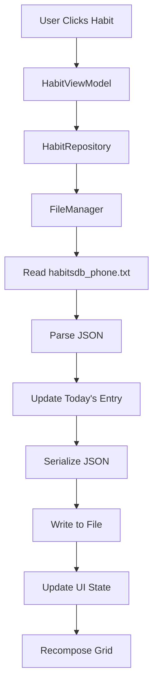
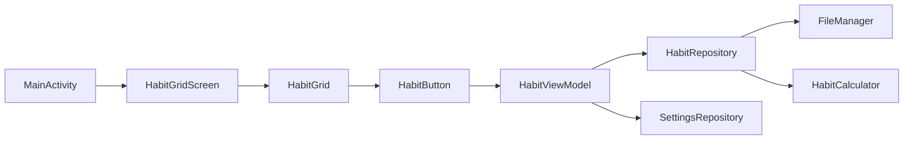
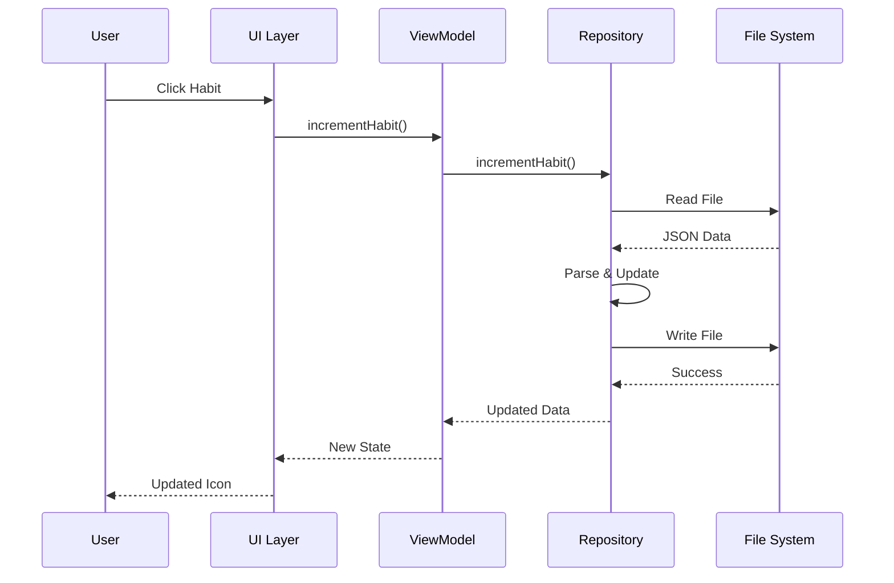

# Habit Tracker Android App - Architecture Plan
**Project:** Tail - Habit Logging Android Application  
**Created:** 2026-03-08  
**Status:** Architecture Design Phase

---

## Executive Summary

This document outlines the architecture for an Android habit tracking application that replaces Tasker-based workflows. The app will maintain compatibility with the existing desktop PyQt widget system by sharing the same data file (`habitsdb_phone.txt`) and replicating the exact grid layout of 76 habit icons (8 columns × 10 rows).

---

## 1. System Overview

### 1.1 Current System Analysis

**Desktop System (PyQt Widget):**
- Grid layout: 8 columns × 10 rows = 80 positions (76 habits + 4 empty spaces)
- Data files:
  - `habitsdb.txt` - Desktop habit records (JSON)
  - `habitsdb_phone.txt` - Phone habit records (JSON, shared file)
  - `habitsdb_to_add.txt` - Pending increments before daily commit
- Icon system: 7 color-coded icon sets based on daily count (0-6+)
- Special habits with custom increment logic (Pushups, Situps, Squats, Cold Shower, Sweat)

**Data Structure (habitsdb_phone.txt):**
```json
{
  "Habit Name": {
    "2026-01-05": 1,
    "2026-01-06": 0,
    "2026-01-07": 2
  }
}
```

**76 Habits (in exact order):**
1. Juggle lights
2. Unique juggle
3. Juggling record broke
4. Dream acted
5. Sleep watch
6. Apnea walked
7. Cold Shower Widget
8. Programming sessions
9. Book read
10. Fiction Book Intake
11. Joggle
12. Create juggle
13. Fun juggle
14. Drm Review
15. Early phone
16. Apnea practiced
17. Launch Squats Widget
18. Juggling tech sessions
19. Podcast finished
20. Fiction Video Intake
21. Blind juggle
22. Song juggle
23. Janki used
24. Lucidity trained
25. Anki created
26. Apnea apb
27. Launch Situps Widget
28. Writing sessions
29. Educational video watched
30. Chess
31. Juggling Balls Carry
32. Move juggle
33. Filmed juggle
34. Unusual experience
35. Anki mydis done
36. Apnea spb
37. Launch Pushups Widget
38. UC post
39. Article read
40. Rabbit Hole
41. Juggling Others Learn
42. Juggle run
43. Watch juggle
44. Meditations
45. Some anki
46. Lung stretch
47. Cardio sessions
48. AI tool
49. Read academic
50. Speak AI
51. Most Collisions
52. Free
53. Inspired juggle
54. Kind stranger
55. Health learned
56. Sweat
57. Good posture
58. Drew
59. Language studied
60. Communication Improved
61. No Coffee
62. Magic practiced
63. Juggle goal
64. Broke record
65. Took pills
66. Fasted
67. HIT
68. Question asked
69. Music listen
70. Unusually Kind
71. Tracked Sleep
72. Magic performed
73. Balanced
74. Grumpy blocker
75. Flossed
76. Todos done
77. Fresh air
78. Talk stranger
79. Memory practice

### 1.2 Icon Color Coding System

Icons change color based on today's count (including pending increments):
- **0**: `redgoldpainthd` (red/gold)
- **1**: `orangewhitepearlhd` (orange/white)
- **2**: `greenfloralhd` (green)
- **3**: `bluewhitepearlhd` (blue/white)
- **4**: `pinkorbhd` (pink)
- **5**: `yellowpainthd` (yellow)
- **6+**: `transparentglasshd` (transparent/glass)

### 1.3 Special Habit Adjustment Logic

Some habits have count adjustments before determining icon color:
- **Pushups Widget**: count ÷ 30 (rounded)
- **Situps Widget**: count ÷ 50 (rounded)
- **Squats Widget**: count ÷ 30 (rounded)
- **Sweat**: count ÷ 15 (rounded)
- **Cold Shower Widget**: 
  - If count > 0 and < 3, set to 3
  - Then count ÷ 3 (rounded)

---

## 2. Android App Architecture

### 2.1 Technology Stack

**Core:**
- Language: Kotlin
- UI Framework: Jetpack Compose
- Architecture: MVVM (Model-View-ViewModel)
- Minimum SDK: 26 (Android 8.0)
- Target SDK: 36

**Key Libraries:**
```kotlin
// Data & Storage
implementation("androidx.datastore:datastore-preferences:1.0.0")
implementation("com.google.code.gson:gson:2.10.1")

// File Access
implementation("androidx.documentfile:documentfile:1.0.1")

// ViewModel & LiveData
implementation("androidx.lifecycle:lifecycle-viewmodel-compose:2.7.0")
implementation("androidx.lifecycle:lifecycle-runtime-compose:2.7.0")

// Coroutines
implementation("org.jetbrains.kotlinx:kotlinx-coroutines-android:1.7.3")
```

### 2.2 Project Structure

```
app/src/main/java/com/example/tail/
├── data/
│   ├── model/
│   │   ├── Habit.kt                    # Habit data class
│   │   ├── HabitEntry.kt               # Date-value pair
│   │   ├── HabitDatabase.kt            # Full database model
│   │   └── AppSettings.kt              # App configuration
│   ├── repository/
│   │   ├── HabitRepository.kt          # Data access layer
│   │   └── SettingsRepository.kt       # Settings management
│   └── util/
│       ├── JsonParser.kt               # JSON serialization
│       ├── FileManager.kt              # File I/O operations
│       └── HabitCalculator.kt          # Streak/stats calculations
├── ui/
│   ├── screens/
│   │   ├── HabitGridScreen.kt          # Main grid view
│   │   ├── SettingsScreen.kt           # Configuration screen
│   │   └── HabitDetailScreen.kt        # Individual habit stats
│   ├── components/
│   │   ├── HabitButton.kt              # Single habit button
│   │   ├── HabitGrid.kt                # 8x10 grid layout
│   │   ├── FilePickerDialog.kt         # File location selector
│   │   ├── IncrementInputDialog.kt     # Custom increment input
│   │   └── HabitConfigList.kt          # Settings habit list
│   └── theme/
│       ├── Color.kt
│       ├── Theme.kt
│       └── Type.kt
├── viewmodel/
│   ├── HabitViewModel.kt               # Main business logic
│   └── SettingsViewModel.kt            # Settings logic
└── MainActivity.kt                      # Entry point
```

### 2.3 Data Layer Design

#### 2.3.1 Data Models

**Habit.kt**
```kotlin
data class Habit(
    val name: String,
    val iconName: String,
    val entries: Map<String, Int> = emptyMap(),
    val position: Int  // Grid position (0-79)
)
```

**HabitDatabase.kt**
```kotlin
data class HabitDatabase(
    val habits: Map<String, Map<String, Int>>
) {
    companion object {
        fun fromJson(json: String): HabitDatabase
        fun toJson(database: HabitDatabase): String
    }
}
```

**AppSettings.kt**
```kotlin
data class AppSettings(
    val habitsDbPhonePath: String = "",
    val lastSyncTime: Long = 0L,
    val autoSyncEnabled: Boolean = true
)
```

#### 2.3.2 Repository Pattern

**HabitRepository.kt**
```kotlin
class HabitRepository(
    private val context: Context,
    private val settingsRepository: SettingsRepository
) {
    // Load habits from habitsdb_phone.txt
    suspend fun loadHabits(): Result<HabitDatabase>
    
    // Save habits to habitsdb_phone.txt
    suspend fun saveHabits(database: HabitDatabase): Result<Unit>
    
    // Increment a habit for today
    suspend fun incrementHabit(habitName: String, amount: Int = 1): Result<Unit>
    
    // Get today's value for a habit
    fun getTodayValue(habitName: String): Int
    
    // Calculate display value (with adjustments)
    fun getDisplayValue(habitName: String, rawValue: Int): Int
}
```

**SettingsRepository.kt**
```kotlin
class SettingsRepository(private val context: Context) {
    private val dataStore = context.dataStore
    
    suspend fun saveFilePath(path: String)
    suspend fun getFilePath(): String?
    suspend fun saveAutoSync(enabled: Boolean)
    fun getAutoSync(): Flow<Boolean>
}
```

### 2.4 UI Layer Design

#### 2.4.1 Main Grid Screen

**HabitGridScreen.kt** - Composable function that displays the 8×10 grid

Key features:
- LazyVerticalGrid with 8 columns
- Each cell is a HabitButton or Spacer
- Displays current streak/antistreak in corner numbers
- Shows icon with appropriate color theme
- Click to increment habit

**Layout:**
```
┌─────────────────────────────────────────┐
│  [Habit] [Habit] [Habit] ... (8 cols)  │
│  [Habit] [Habit] [Habit] ...            │
│  [Habit] [Habit] [Habit] ...            │
│  ...     ...     ...     ... (10 rows)  │
│  [Habit] [Habit] [Empty] [Empty]        │
└─────────────────────────────────────────┘
```

#### 2.4.2 Habit Button Component

**HabitButton.kt**
```kotlin
@Composable
fun HabitButton(
    habit: Habit,
    todayValue: Int,
    currentStreak: Int,
    longestStreak: Int,
    allTimeHigh: Int,
    onClick: () -> Unit
) {
    // 100dp × 100dp button
    // Icon from appropriate color folder
    // Numbers in corners:
    //   - Top-left: All-time high (day)
    //   - Bottom-left: Current streak/antistreak
    //   - Bottom-right: Longest streak
}
```

#### 2.4.3 Settings Screen

**SettingsScreen.kt**

Features:
- File path selector for `habitsdb_phone.txt`
- Auto-sync toggle
- Manual sync button
- Last sync timestamp display
- App version info

### 2.5 ViewModel Layer

**HabitViewModel.kt**
```kotlin
class HabitViewModel(
    private val repository: HabitRepository
) : ViewModel() {
    
    private val _habits = MutableStateFlow<List<Habit>>(emptyList())
    val habits: StateFlow<List<Habit>> = _habits.asStateFlow()
    
    private val _isLoading = MutableStateFlow(false)
    val isLoading: StateFlow<Boolean> = _isLoading.asStateFlow()
    
    // Load habits from file
    fun loadHabits()
    
    // Increment a habit
    fun incrementHabit(habitName: String, amount: Int = 1)
    
    // Calculate streak for a habit
    fun calculateStreak(habitName: String): Int
    
    // Calculate longest streak
    fun calculateLongestStreak(habitName: String): Int
    
    // Get all-time high for a habit
    fun getAllTimeHigh(habitName: String): Int
    
    // Get display value (with adjustments)
    fun getDisplayValue(habitName: String): Int
}
```

---

## 3. Key Features & Implementation Details

### 3.1 File Synchronization

**Strategy:** Direct file access via Storage Access Framework (SAF)

**Flow:**
1. User selects `habitsdb_phone.txt` location on first launch
2. App requests persistent URI permission
3. On habit increment:
   - Read current file
   - Parse JSON
   - Update today's entry for the habit
   - Write back to file
4. File is immediately synced (no pending queue like desktop)

**Conflict Resolution:**
- Always use latest file content before writing
- Atomic read-modify-write operations
- File locking via synchronized blocks

### 3.2 Habit Increment Logic

**Standard Habits:**
```kotlin
fun incrementHabit(habitName: String) {
    val today = getCurrentDate() // "YYYY-MM-DD"
    val currentValue = getTodayValue(habitName)
    updateHabitValue(habitName, today, currentValue + 1)
}
```

**Widget Habits (Pushups, Situps, Squats):**
```kotlin
fun incrementWidgetHabit(habitName: String) {
    // Show dialog to input custom amount
    showInputDialog { amount ->
        val today = getCurrentDate()
        val currentValue = getTodayValue(habitName)
        updateHabitValue(habitName, today, currentValue + amount)
    }
}
```

**Special Habits (Broke record, Apnea spb):**
- These require additional dialogs in desktop version
- For Android MVP: treat as standard increment
- Future enhancement: add record tracking

### 3.3 Icon System

**Icon Assets:**
- Copy all icons from `/home/twain/Projects/py_habits_widget/icons/`
- Organize in `app/src/main/res/drawable/` by color folder
- Naming convention: `{color}_{iconname}.png`
  - Example: `pinkorbhd_magic_wand.png`

**Icon Selection Logic:**
```kotlin
fun getIconResource(habitName: String, displayValue: Int): Int {
    val iconName = IconMapper.getIconName(habitName)
    val colorFolder = when (displayValue) {
        0 -> "redgoldpainthd"
        1 -> "orangewhitepearlhd"
        2 -> "greenfloralhd"
        3 -> "bluewhitepearlhd"
        4 -> "pinkorbhd"
        5 -> "yellowpainthd"
        else -> "transparentglasshd"
    }
    return getDrawableId("${colorFolder}_${iconName}")
}
```

**IconMapper.kt** - Maps habit names to icon names (from IconFinder.py)

### 3.4 Streak Calculations

**Current Streak/Antistreak:**
```kotlin
fun getCurrentStreak(entries: Map<String, Int>): Int {
    val sortedDates = entries.keys.sortedDescending()
    var streak = 0
    
    for (date in sortedDates) {
        if (entries[date] != 0) {
            streak++
        } else {
            break
        }
    }
    
    return streak
}

fun getCurrentAntistreak(entries: Map<String, Int>): Int {
    val sortedDates = entries.keys.sortedDescending()
    var antistreak = 0
    
    for (date in sortedDates) {
        if (entries[date] == 0) {
            antistreak++
        } else {
            break
        }
    }
    
    return antistreak
}
```

**Display Logic:**
- If current streak >= 2: show positive streak
- If current streak < 2: show negative antistreak

### 3.5 Grid Layout Specification

**Exact Grid Positions (8 columns × 10 rows):**

| Row | Col 0 | Col 1 | Col 2 | Col 3 | Col 4 | Col 5 | Col 6 | Col 7 |
|-----|-------|-------|-------|-------|-------|-------|-------|-------|
| 1   | Juggle lights | Unique juggle | Juggling record broke | Dream acted | Sleep watch | Apnea walked | Cold Shower Widget | Programming sessions |
| 2   | Book read | Fiction Book Intake | Joggle | Create juggle | Fun juggle | Drm Review | Early phone | Apnea practiced |
| 3   | Launch Squats Widget | Juggling tech sessions | Podcast finished | Fiction Video Intake | Blind juggle | Song juggle | Janki used | Lucidity trained |
| 4   | Anki created | Apnea apb | Launch Situps Widget | Writing sessions | Educational video watched | Chess | Juggling Balls Carry | Move juggle |
| 5   | Filmed juggle | Unusual experience | Anki mydis done | Apnea spb | Launch Pushups Widget | UC post | Article read | Rabbit Hole |
| 6   | Juggling Others Learn | Juggle run | Watch juggle | Meditations | Some anki | Lung stretch | Cardio sessions | AI tool |
| 7   | Read academic | Speak AI | Most Collisions | Free | Inspired juggle | Kind stranger | Health learned | Sweat |
| 8   | Good posture | Drew | Language studied | Communication Improved | No Coffee | Magic practiced | Juggle goal | Broke record |
| 9   | Took pills | Fasted | HIT | Question asked | Music listen | Unusually Kind | Tracked Sleep | Magic performed |
| 10  | Balanced | Grumpy blocker | Flossed | Todos done | Fresh air | Talk stranger | Memory practice | [Empty] |

**Note:** Positions 77-80 (last 4 in row 10) are empty spacers

---

## 4. Implementation Phases

### Phase 1: Core Infrastructure
- Set up data models
- Implement JSON parsing
- Create file I/O with SAF
- Build settings repository

### Phase 2: Basic UI
- Create main grid layout (8×10)
- Implement habit button component
- Add basic click handling
- Display static icons

### Phase 3: Data Integration
- Connect ViewModel to Repository
- Implement habit increment logic
- Add file read/write operations
- Handle special habit adjustments

### Phase 4: Icon System
- Migrate all icon assets
- Implement icon color selection
- Create IconMapper from IconFinder.py
- Apply dynamic icon loading

### Phase 5: Streak Calculations
- Implement streak algorithms
- Add antistreak calculations
- Display corner numbers on buttons
- Calculate all-time highs

### Phase 6: Settings & Polish
- Build settings screen
- Add file picker dialog
- Implement auto-sync
- Error handling & validation

### Phase 7: Testing & Refinement
- Test file synchronization
- Verify grid layout matches desktop
- Test all special habit cases
- Performance optimization

---

## 5. Critical Requirements

### 5.1 Must-Have Features

1. **Exact Grid Replication**
   - 8 columns × 10 rows
   - Exact habit order matching desktop
   - Same icon positions

2. **File Compatibility**
   - Read/write `habitsdb_phone.txt` in same JSON format
   - Maintain compatibility with desktop app
   - No data corruption

3. **Icon System**
   - All 76 habit icons
   - 7 color variations each
   - Correct color selection based on count

4. **Special Habit Logic**
   - Pushups/Situps/Squats/Sweat/Cold Shower adjustments
   - Widget habits with custom input
   - Correct rounding logic

5. **Streak Display**
   - Current streak/antistreak (bottom-left)
   - Longest streak (bottom-right)
   - All-time high day (top-left)

### 5.2 Data Integrity

**Critical:** The app must never corrupt `habitsdb_phone.txt`

**Safety Measures:**
- Validate JSON before writing
- Backup file before modifications
- Atomic write operations
- Error recovery mechanisms

### 5.3 Performance Targets

- Grid load time: < 500ms
- Habit increment response: < 100ms
- File sync: < 200ms
- Smooth scrolling (60 FPS)

---

## 6. File Structure Reference

### 6.1 habitsdb_phone.txt Format

```json
{
  "Habit Name": {
    "2026-01-05": 1,
    "2026-01-06": 0,
    "2026-01-07": 2,
    "2026-01-08": 1
  },
  "Another Habit": {
    "2026-01-05": 0,
    "2026-01-06": 1
  }
}
```

**Rules:**
- Top-level keys: Habit names (exact match required)
- Second-level keys: Dates in "YYYY-MM-DD" format
- Values: Integer counts (0 or positive)
- Sorted by date (ascending)

### 6.2 Icon Folder Structure

```
icons/
├── redgoldpainthd/          # Count = 0
├── orangewhitepearlhd/      # Count = 1
├── greenfloralhd/           # Count = 2
├── bluewhitepearlhd/        # Count = 3
├── pinkorbhd/               # Count = 4
├── yellowpainthd/           # Count = 5
└── transparentglasshd/      # Count = 6+
```

Each folder contains the same icon names with different colors.

---

## 7. User Interface Mockup

```
┌─────────────────────────────────────────────────────┐
│  Habit Tracker                            [⚙️]      │
├─────────────────────────────────────────────────────┤
│                                                     │
│  ┌───┐ ┌───┐ ┌───┐ ┌───┐ ┌───┐ ┌───┐ ┌───┐ ┌───┐ │
│  │ 5 │ │ 3 │ │ 2 │ │ 4 │ │ 1 │ │ 6 │ │ 3⁺│ │ 7 │ │
│  │🌸 │ │🎯 │ │🎪 │ │🚢 │ │⏰ │ │🎺 │ │❄️ │ │💻 │ │
│  │-2│ │ 1│ │ 0│ │-1│ │ 3│ │ 2│ │ 1│ │ 4│ │
│  └───┘ └───┘ └───┘ └───┘ └───┘ └───┘ └───┘ └───┘ │
│                                                     │
│  ┌───┐ ┌───┐ ┌───┐ ┌───┐ ┌───┐ ┌───┐ ┌───┐ ┌───┐ │
│  │ 2 │ │ 1 │ │ 3 │ │ 4 │ │ 2 │ │ 1 │ │ 5 │ │ 3 │ │
│  │📖 │ │📚 │ │🏃 │ │🦋 │ │🎵 │ │⚓ │ │📱 │ │🎺 │ │
│  │ 1│ │-1│ │ 2│ │ 0│ │ 1│ │ 3│ │-2│ │ 1│ │
│  └───┘ └───┘ └───┘ └───┘ └───┘ └───┘ └───┘ └───┘ │
│                                                     │
│  ... (8 more rows)                                 │
│                                                     │
└─────────────────────────────────────────────────────┘

Legend:
- Top-left number: All-time high (day)
- Bottom-left number: Current streak (positive) or antistreak (negative)
- Bottom-right number: Longest streak
- Icon color: Based on today's count (0-6+)
- Small ⁺ badge: Custom increment mode enabled
- Tap: Increment (simple or show dialog based on mode)
- Long-press: Toggle increment mode
```

**Settings Screen - Habit Configuration:**
```
┌─────────────────────────────────────────────────────┐
│  ← Settings                                         │
├─────────────────────────────────────────────────────┤
│                                                     │
│  File Location                                      │
│  /storage/emulated/0/noteVault/habitsdb_phone.txt  │
│  [Change File]                                      │
│                                                     │
│  ─────────────────────────────────────────────────  │
│                                                     │
│  Habit Increment Mode                               │
│  [Search habits...]                                 │
│                                                     │
│  ☐ AI tool                          [Simple ▼]     │
│  ☐ Anki created                     [Simple ▼]     │
│  ☐ Apnea walked                     [Simple ▼]     │
│  ☑ Cold Shower Widget               [Custom ▼]     │
│  ☐ Dream acted                      [Simple ▼]     │
│  ...                                                │
│  ☑ Launch Pushups Widget            [Custom ▼]     │
│  ☑ Launch Situps Widget             [Custom ▼]     │
│  ☑ Launch Squats Widget             [Custom ▼]     │
│  ...                                                │
│  ☑ Sweat                            [Custom ▼]     │
│  ...                                                │
│                                                     │
│  [Reset to Defaults]                                │
│                                                     │
└─────────────────────────────────────────────────────┘
```

**Custom Increment Dialog:**
```
┌─────────────────────────────────────┐
│  Launch Pushups Widget              │
├─────────────────────────────────────┤
│                                     │
│  Current today: 45                  │
│                                     │
│  Enter increment amount:            │
│  ┌─────────────────────────────┐   │
│  │ 30                          │   │
│  └─────────────────────────────┘   │
│                                     │
│  Quick add:                         │
│  [+1]  [+5]  [+10]  [+30]  [+50]   │
│                                     │
│  ┌──────────┐      ┌──────────┐    │
│  │  Cancel  │      │    OK    │    │
│  └──────────┘      └──────────┘    │
│                                     │
└─────────────────────────────────────┘
```

---

## 8. Risk Assessment & Mitigation

### 8.1 Risks

| Risk | Impact | Probability | Mitigation |
|------|--------|-------------|------------|
| File corruption | High | Medium | Atomic writes, validation, backups |
| Icon asset size | Medium | Low | Optimize PNGs, use WebP |
| Sync conflicts | Medium | Medium | Read-before-write, file locking |
| Performance issues | Medium | Low | Lazy loading, caching |
| Storage permissions | Low | Medium | Clear user guidance, SAF |

### 8.2 Mitigation Strategies

**File Corruption Prevention:**
- Validate JSON schema before writing
- Create temporary backup before modifications
- Use try-catch with rollback on errors
- Implement file integrity checks

**Performance Optimization:**
- Cache parsed habit data in memory
- Use Compose remember for icon resources
- Lazy load icons as needed
- Debounce file writes

**User Experience:**
- Clear error messages
- Graceful degradation
- Offline capability
- Progress indicators

---

## 9. Testing Strategy

### 9.1 Unit Tests

- JSON parsing/serialization
- Habit calculation logic
- Streak algorithms
- Icon selection logic
- Special habit adjustments

### 9.2 Integration Tests

- File read/write operations
- Repository layer
- ViewModel state management
- Settings persistence

### 9.3 UI Tests

- Grid layout rendering
- Button click handling
- Navigation flows
- Dialog interactions

### 9.4 Manual Testing

- File sync with desktop app
- Icon color accuracy
- Grid layout matching
- All 76 habits functional
- Special habit cases

---

## 10. Future Enhancements

### 10.1 Phase 2 Features

- Habit statistics screen
- Graphs and charts
- Backup/restore functionality
- Multiple file support
- Dark/light theme toggle

### 10.2 Advanced Features

- Widget for home screen
- Notifications/reminders
- Cloud sync option
- Export to CSV
- Habit templates
- Personal records tracking (Broke record, Apnea spb)

---

## 11. Dependencies & Resources

### 11.1 Required Assets

**From `/home/twain/Projects/py_habits_widget/`:**
- All icon PNG files from 7 color folders
- IconFinder.py mapping (convert to Kotlin)
- Habit order list (76 habits)

### 11.2 External Dependencies

```kotlin
// build.gradle.kts additions needed:
dependencies {
    // Gson for JSON
    implementation("com.google.code.gson:gson:2.10.1")
    
    // DataStore for settings
    implementation("androidx.datastore:datastore-preferences:1.0.0")
    
    // Coil for image loading (if needed)
    implementation("io.coil-kt:coil-compose:2.5.0")
    
    // DocumentFile for SAF
    implementation("androidx.documentfile:documentfile:1.0.1")
}
```

---

## 12. Acceptance Criteria

The Android app is complete when:

- ✅ Grid displays exactly 8×10 with correct habit positions
- ✅ All 76 habits have correct icons in all 7 colors
- ✅ Clicking a habit increments today's count in habitsdb_phone.txt
- ✅ Icons change color based on today's count (with adjustments)
- ✅ Corner numbers display correct streak/antistreak/longest/ATH
- ✅ Special habits (Pushups, etc.) apply correct adjustments
- ✅ Widget habits show input dialog
- ✅ File is compatible with desktop app (no corruption)
- ✅ Settings screen allows file path configuration
- ✅ App handles missing file gracefully
- ✅ Performance meets targets (< 500ms load)

---

## 13. Architecture Diagrams

### 13.1 Data Flow



### 13.2 Component Architecture



### 13.3 File Sync Flow



---

## 14. Development Timeline Estimate

**Note:** Time estimates removed per user instructions. Tasks listed in logical order.

### Phase 1: Foundation
- Project setup and dependencies
- Data models creation
- JSON parser implementation
- File I/O with SAF

### Phase 2: Core Logic
- Repository layer
- ViewModel implementation
- Habit calculation logic
- Streak algorithms

### Phase 3: UI Development
- Grid layout
- Habit button component
- Icon system integration
- Click handling

### Phase 4: Icon Migration
- Asset preparation
- Icon mapper creation
- Color selection logic
- Resource loading

### Phase 5: Integration
- Connect all layers
- File synchronization
- Settings screen
- Error handling

### Phase 6: Testing & Polish
- Unit tests
- Integration tests
- Manual testing
- Bug fixes
- Performance optimization

---

## 15. Questions for Clarification

Before implementation, please confirm:

1. **File Location:** Should the app support selecting the file from any location (cloud storage, local, etc.) or only local storage?

2. **Widget Habits:** For "Launch Pushups Widget", "Launch Situps Widget", "Launch Squats Widget" - should these show an input dialog on Android, or just increment by 1?

3. **Special Habits:** "Broke record" and "Apnea spb" have complex dialogs in desktop version. Should we implement these in Phase 1 or defer to Phase 2?

4. **Empty Positions:** The grid has 4 empty positions at the end. Should these be completely empty or show placeholder icons?

5. **Sync Strategy:** Should the app write to the file immediately on each increment, or batch updates and sync periodically?

6. **Offline Mode:** What should happen if the file is not accessible (e.g., cloud storage offline)?

---

## Conclusion

This architecture provides a solid foundation for building an Android habit tracker that maintains full compatibility with the existing desktop system while providing a native mobile experience. The modular design allows for incremental development and future enhancements while ensuring data integrity and performance.

The key success factors are:
1. Exact grid layout replication
2. File format compatibility
3. Correct icon color system
4. Proper streak calculations
5. Special habit handling

Once approved, this plan can be handed off to Code mode for implementation.
