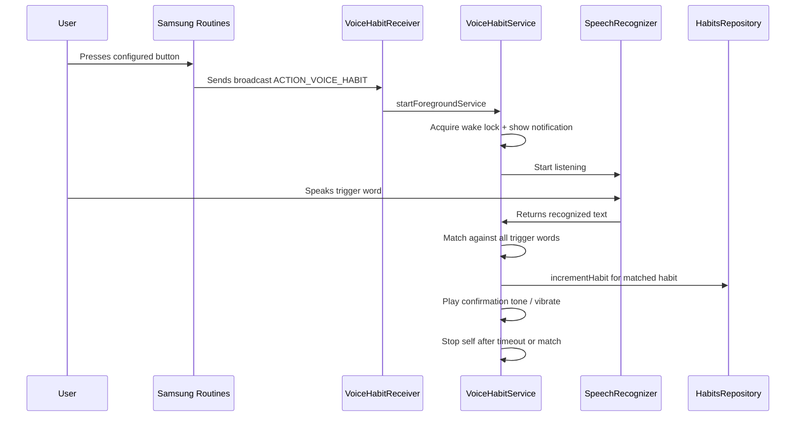

# Voice Trigger Habit Increment — Architecture Plan

**Created:** 2026-04-13  
**Status:** Draft — awaiting approval

---

## Overview

Add the ability to increment habits via voice trigger words when the phone screen is off and Tail is closed. The user configures trigger words per-habit in edit mode. A Samsung Routines button press launches a foreground service that listens for speech, matches trigger words, and increments the corresponding habit.

---

## How It Works (End-to-End Flow)



---

## Architecture Decisions

### Why a BroadcastReceiver + ForegroundService?

- **BroadcastReceiver** (`VoiceHabitReceiver`): Samsung Routines can send an explicit broadcast as its "Then" action. This is the simplest integration point — no need for Tail to be running. The receiver is a lightweight entry point that just starts the service.
- **ForegroundService** (`VoiceHabitService`): `SpeechRecognizer` requires an active Android context and cannot run in a BroadcastReceiver (10-second limit). A foreground service with a persistent notification is the correct pattern for microphone access from the background on Android 12+.

### Why not a persistent always-listening service?

Battery drain would be extreme. The Samsung Routines trigger approach is far better — the microphone only activates for a short window (e.g., 10 seconds) after the user deliberately presses a button.

### Why Samsung Routines instead of in-app always-on hotword?

Android does not allow third-party apps to do always-on hotword detection (that's reserved for the system assistant via `VoiceInteractionService`). Samsung Routines provides the "hardware trigger → app action" bridge that makes this possible without root or system-level access.

---

## Components to Build

### 1. Data Layer — Trigger Word Storage

**Files modified:** [`HabitModels.kt`](app/src/main/java/com/example/tail/data/HabitModels.kt), [`SettingsRepository.kt`](app/src/main/java/com/example/tail/data/SettingsRepository.kt)

Add to `AppSettings`:
```kotlin
/** Global on/off for voice trigger feature (must be enabled in Settings). */
val voiceTriggerEnabled: Boolean = false,

/** Habits that have voice trigger enabled. */
val voiceTriggerHabits: Set<String> = emptySet(),

/** Maps habit name → set of trigger words (lowercase). */
val voiceTriggerWords: Map<String, Set<String>> = emptyMap()
```

Storage pattern: follows the existing `conditionalLinkedHabits` pattern exactly — `Map<String, Set<String>>` encoded with `PAIR_SEP`/`KV_SEP`/`LINK_SEP`.

New DataStore keys:
- `KEY_VOICE_TRIGGER_ENABLED` — `booleanPreferencesKey` (global on/off)
- `KEY_VOICE_TRIGGER_HABITS` — `stringSetPreferencesKey`
- `KEY_VOICE_TRIGGER_WORDS` — `stringPreferencesKey` (encoded map)

New save methods:
- `saveVoiceTriggerEnabled(enabled: Boolean)`
- `saveVoiceTriggerHabits(habits: Set<String>)`
- `saveVoiceTriggerWords(words: Map<String, Set<String>>)`

### 2. VoiceHabitReceiver — BroadcastReceiver

**New file:** `app/src/main/java/com/example/tail/ipc/VoiceHabitReceiver.kt`

```kotlin
class VoiceHabitReceiver : BroadcastReceiver() {
    override fun onReceive(context: Context, intent: Intent) {
        if (intent.action != ACTION_VOICE_HABIT) return
        val serviceIntent = Intent(context, VoiceHabitService::class.java)
        ContextCompat.startForegroundService(context, serviceIntent)
    }
    companion object {
        const val ACTION_VOICE_HABIT = "com.example.tail.ACTION_VOICE_HABIT"
    }
}
```

Key points:
- **Exported, no permission restriction** — Samsung Routines is not signed with our keystore, so we cannot use the `TAIL_INTEGRATION` signature permission. The broadcast action is unique enough, and the worst case is someone triggers a voice listen session (no data leak).
- Manifest registration with `<intent-filter>` for `ACTION_VOICE_HABIT`.

### 3. VoiceHabitService — ForegroundService

**New file:** `app/src/main/java/com/example/tail/ipc/VoiceHabitService.kt`

This is the core component. Responsibilities:

1. **Start as foreground service** with `FOREGROUND_SERVICE_TYPE_MICROPHONE` and a notification ("Listening for habit trigger…")
2. **Acquire a partial wake lock** to keep the CPU alive while the screen is off
3. **Load trigger words** from `SettingsRepository` (all habits that have voice trigger enabled)
4. **Create `SpeechRecognizer`** and start listening
5. **On speech results**: lowercase the recognized text, check if any trigger word is contained in it
6. **On match**: increment the habit via `HabitsRepository.incrementHabit()` (same pattern as `HabitIncrementReceiver`), play a short confirmation tone, vibrate
7. **On no match or timeout**: optionally retry once, then stop self
8. **Auto-stop** after a configurable timeout (default 8 seconds) to prevent battery drain

```kotlin
class VoiceHabitService : Service() {
    // Foreground notification
    // Wake lock
    // SpeechRecognizer with RecognitionListener
    // Load voiceTriggerWords from SettingsRepository
    // Match logic: for each recognized phrase, check all trigger words
    // Increment matched habit via HabitsRepository
    // Conditional habit propagation (same as HabitIncrementReceiver)
    // Tasker file update
    // Stop self after match or timeout
}
```

Service lifecycle:
- `onCreate()` → create notification channel, acquire wake lock
- `onStartCommand()` → show foreground notification, load settings, start speech recognition
- Recognition callback → match + increment → stop self
- Timeout handler (8s) → stop self
- `onDestroy()` → release wake lock, destroy SpeechRecognizer

### 4. Permissions

**File modified:** [`AndroidManifest.xml`](app/src/main/AndroidManifest.xml)

```xml
<uses-permission android:name="android.permission.RECORD_AUDIO" />
<uses-permission android:name="android.permission.FOREGROUND_SERVICE" />
<uses-permission android:name="android.permission.FOREGROUND_SERVICE_MICROPHONE" />
<uses-permission android:name="android.permission.WAKE_LOCK" />
```

Service declaration:
```xml
<service
    android:name=".ipc.VoiceHabitService"
    android:exported="false"
    android:foregroundServiceType="microphone" />
```

Receiver declaration:
```xml
<receiver
    android:name=".ipc.VoiceHabitReceiver"
    android:exported="true">
    <intent-filter>
        <action android:name="com.example.tail.ACTION_VOICE_HABIT" />
    </intent-filter>
</receiver>
```

**Runtime permission**: `RECORD_AUDIO` is a dangerous permission — must be requested at runtime. We'll request it when the user first enables voice trigger for any habit in edit mode. If denied, the toggle stays off with a toast explaining why.

### 5. Global Settings Toggle

**File modified:** [`SettingsScreen.kt`](app/src/main/java/com/example/tail/ui/SettingsScreen.kt)

Add a "🎤 Voice Trigger" section in the Settings screen (similar to the Chess.com or AI Icons sections). Contains:
- **Enable toggle**: Global on/off for the voice trigger feature
- **Subtitle**: "Enable voice-triggered habit increments via Samsung Routines"
- When disabled globally, the per-habit toggle in edit mode is hidden (same pattern as Chess.com link toggle which only shows when `chessComEnabled` is true)

The `VoiceHabitService` also checks this global flag — if disabled, it immediately stops itself without listening.

### 6. Edit Mode UI — Voice Trigger Toggle + Trigger Words Input

**File modified:** [`HabitGridScreen.kt`](app/src/main/java/com/example/tail/ui/HabitGridScreen.kt)

Add a new section in the SETTINGS area of `EditModeControlBar`, following the existing pattern. Position it after the "Disabled" toggle and before the Chess.com section:

```
┌─────────────────────────────────────────────┐
│ 🎤 Voice Trigger          [ℹ]    [switch]  │
│   "Say trigger word to increment"           │
│                                             │
│   Trigger words (comma-separated):          │
│   ┌─────────────────────────────────────┐   │
│   │ pushups, push ups, push-ups         │   │
│   └─────────────────────────────────────┘   │
└─────────────────────────────────────────────┘
```

Components (only shown when global `voiceTriggerEnabled` is true):
- **Toggle row**: "🎤 Voice Trigger" label + subtitle + info ℹ button + Switch
- **Info ℹ button**: Opens `VoiceTriggerInfoDialog` (see below)
- **Trigger words input** (shown when toggle is on): `OutlinedTextField` for comma-separated words, same pattern as the Subtypes editor
- **Runtime permission request**: When toggling on, check/request `RECORD_AUDIO` permission first

### 7. VoiceTriggerInfoDialog — Samsung Routines Setup Instructions

**New composable** (in `HabitGridScreen.kt` or a separate file if HabitGridScreen is too large):

A scrollable dialog following the exact pattern of `DatedEntryInfoDialog`. Content:

```
━━━━━━━━━━━━━━━━━━━━━━━━━━━━━━━━━━━━━━━━━━━━
  🎤 Voice Trigger Setup
━━━━━━━━━━━━━━━━━━━━━━━━━━━━━━━━━━━━━━━━━━━━

  How it works:
  When triggered, Tail listens for ~8 seconds
  through your microphone. If it hears one of
  your configured trigger words, it increments
  the matching habit — even with the screen off.

  ── Samsung Routines Setup ──────────────────

  1. Open Settings → Modes and Routines
     (or search "Routines" in Settings)

  2. Tap the "+" to create a new routine

  3. Set your trigger ("If"):
     • "Button" → choose a button combo
       (e.g., double-press Side key)
     • Or any other trigger you prefer

  4. Set the action ("Then"):
     • Tap "Then" → "Apps" → scroll down
       to "Send broadcast"
     • Package: com.example.tail
     • Action:  com.example.tail.ACTION_VOICE_HABIT

     ── Alternative (simpler) ──
     If "Send broadcast" is not available:
     • Tap "Then" → "Apps" → "Open app"
     • Select "Tail"
     (This opens the app but won't auto-listen)

  5. Save the routine and test it!

  ── Tips ────────────────────────────────────

  • Speak clearly within ~8 seconds
  • Trigger words are case-insensitive
  • Partial matches work: saying "I did pushups"
    matches the trigger word "pushups"
  • Multiple habits can have the same trigger word
    — all matching habits will be incremented
  • A confirmation vibration means it matched

  ── Permissions ─────────────────────────────

  Tail needs microphone permission to listen.
  You'll be prompted when you first enable
  voice trigger for any habit.

                                    [Got it]
━━━━━━━━━━━━━━━━━━━━━━━━━━━━━━━━━━━━━━━━━━━━
```

### 8. ViewModel Methods

**File modified:** [`HabitViewModel.kt`](app/src/main/java/com/example/tail/ui/HabitViewModel.kt)

New methods following existing patterns:

```kotlin
fun saveVoiceTriggerEnabled(enabled: Boolean)  // global on/off (called from Settings)
fun toggleVoiceTrigger(habitName: String)      // toggle on/off in voiceTriggerHabits set
fun setVoiceTriggerWords(habitName: String, words: Set<String>)  // save trigger words
```

### 9. EditModeControlBar Parameter Additions

New parameters to add to `EditModeControlBar`:
- `voiceTriggerEnabled: Boolean` (global flag — controls visibility of the section)
- `voiceTriggerHabits: Set<String>`
- `voiceTriggerWords: Map<String, Set<String>>`
- `onToggleVoiceTrigger: (String) -> Unit`
- `onSetVoiceTriggerWords: (String, Set<String>) -> Unit`

---

## Files Changed Summary

| File | Change Type | Description |
|------|-------------|-------------|
| `HabitModels.kt` | Modified | Add `voiceTriggerEnabled`, `voiceTriggerHabits`, and `voiceTriggerWords` to `AppSettings` |
| `SettingsRepository.kt` | Modified | Add DataStore keys, decode/encode, save methods for voice trigger data |
| `HabitViewModel.kt` | Modified | Add `saveVoiceTriggerEnabled()`, `toggleVoiceTrigger()`, and `setVoiceTriggerWords()` methods |
| `HabitGridScreen.kt` | Modified | Add voice trigger toggle + words input + info button in EditModeControlBar (only when globally enabled) |
| `SettingsScreen.kt` | Modified | Add global "🎤 Voice Trigger" enable/disable section |
| `VoiceHabitReceiver.kt` | **New** | BroadcastReceiver for `ACTION_VOICE_HABIT` |
| `VoiceHabitService.kt` | **New** | ForegroundService with SpeechRecognizer, wake lock, trigger matching |
| `AndroidManifest.xml` | Modified | Add permissions + service + receiver declarations |

---

## What This Does NOT Do

- **No always-on listening** — only listens for ~8 seconds after a Samsung Routines trigger
- **No custom wake word** — relies on Samsung Routines for the hardware trigger
- **No Google Assistant integration** — that would require a completely different architecture
- **No offline speech recognition guarantee** — uses Android's built-in `SpeechRecognizer` which may require internet on some devices (Samsung S23+ has offline recognition available)

---

## Implementation Order

1. Data layer: `HabitModels.kt` + `SettingsRepository.kt` (trigger word storage + global flag)
2. `VoiceHabitReceiver.kt` (simple broadcast receiver)
3. `VoiceHabitService.kt` (foreground service with speech recognition, 8s timeout)
4. `AndroidManifest.xml` (permissions + component declarations)
5. `HabitViewModel.kt` (toggle + save methods)
6. `SettingsScreen.kt` (global voice trigger enable/disable toggle)
7. `HabitGridScreen.kt` (UI: per-habit toggle, words input, info dialog, permission request)
8. Test on device with Samsung Routines
